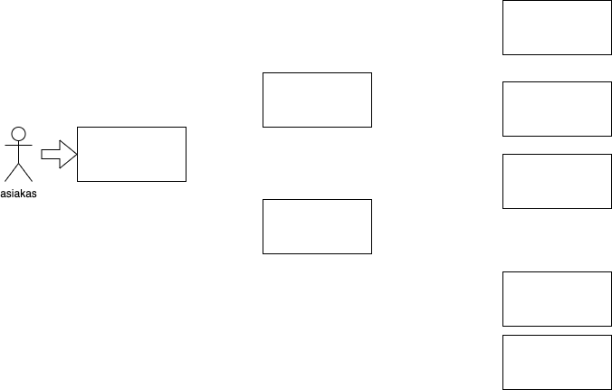
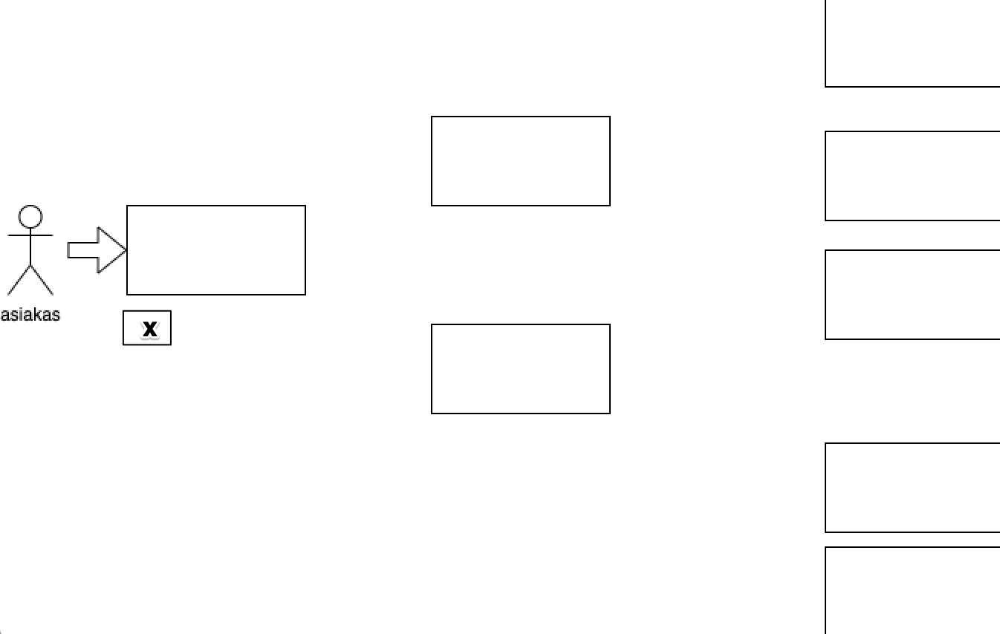
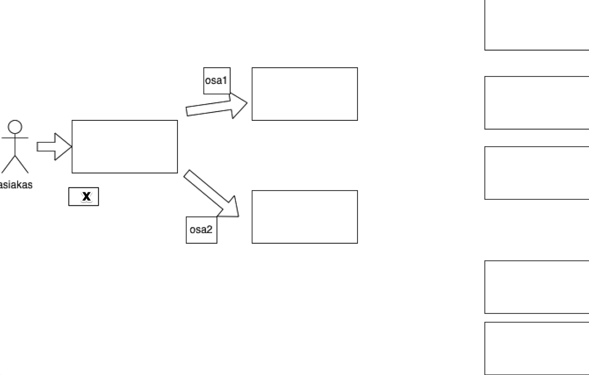
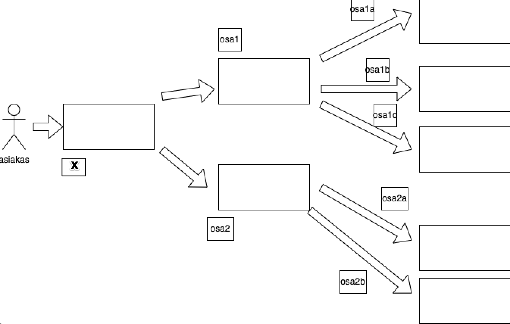
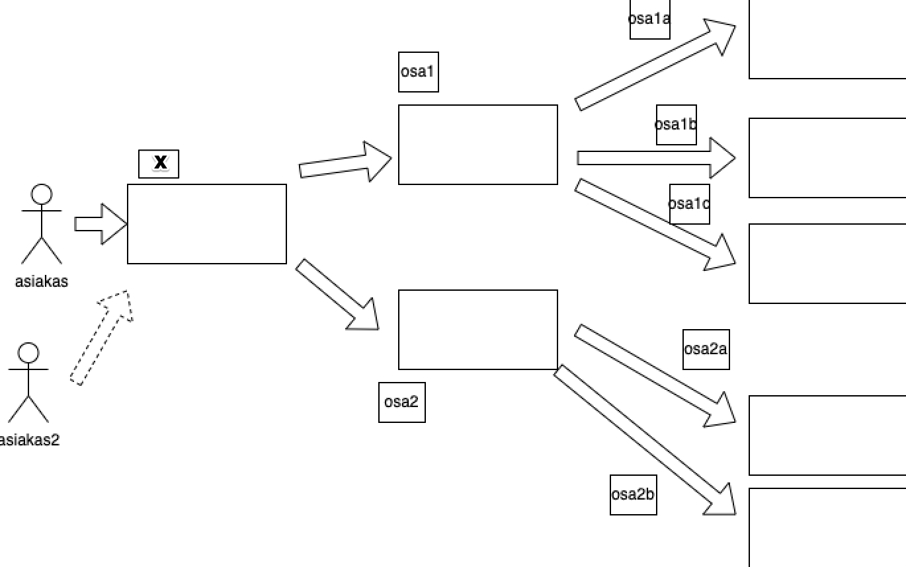
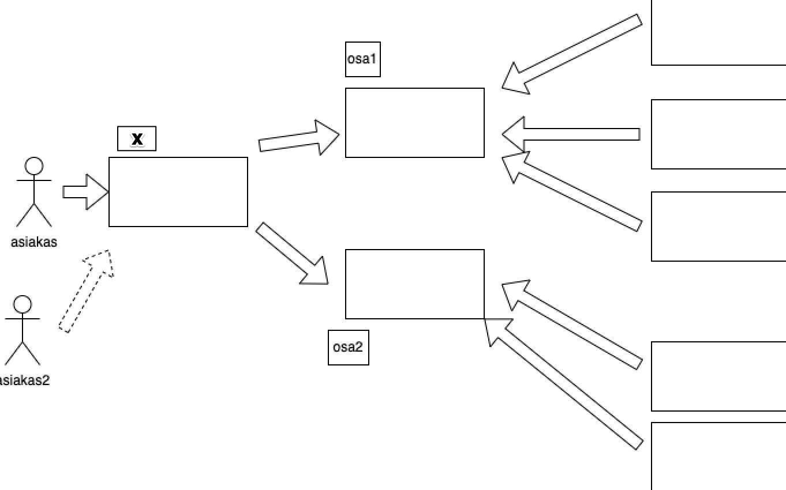
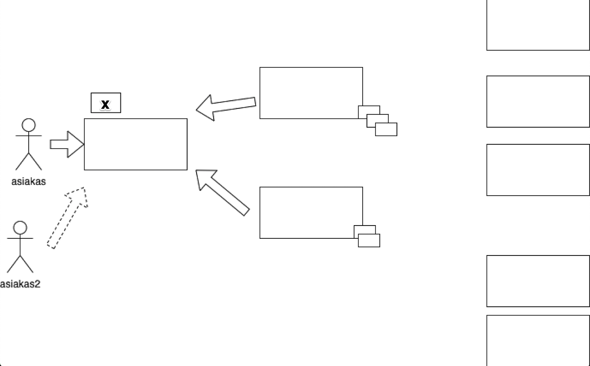
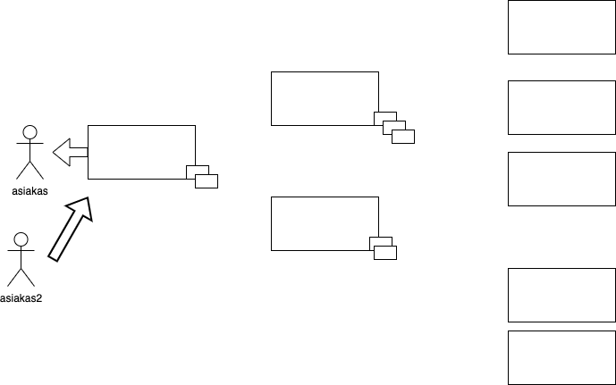

% Ohjelmistotuotanto
% Matti Luukkainen ja ohjaajat Kalle Ilves, Antti Kantola, Riikka Korolainen, Touko Puro
% syksy 2021

&nbsp;&nbsp;&nbsp;&nbsp;&nbsp;&nbsp;&nbsp;&nbsp;&nbsp;&nbsp;&nbsp;&nbsp;&nbsp;&nbsp;&nbsp;&nbsp;&nbsp;&nbsp;&nbsp;&nbsp;&nbsp;&nbsp;&nbsp;&nbsp;&nbsp;&nbsp;&nbsp;&nbsp;&nbsp;&nbsp;&nbsp;&nbsp;&nbsp;&nbsp;&nbsp;&nbsp;&nbsp;Luento 9

&nbsp;&nbsp;&nbsp;&nbsp;&nbsp;&nbsp;&nbsp;&nbsp;&nbsp;&nbsp;&nbsp;&nbsp;&nbsp;&nbsp;&nbsp;&nbsp;&nbsp;&nbsp;&nbsp;&nbsp;&nbsp;&nbsp;&nbsp;&nbsp;&nbsp;&nbsp;&nbsp;&nbsp;&nbsp;&nbsp;&nbsp;&nbsp;&nbsp;&nbsp;&nbsp;&nbsp;29.11.2021

# Kurssin kaksi viimeistä viikkoa

- Miniprojektit jatkuvat
  - tällä ja ensiviikolla asiakastapaaminen

. . .

- Loppudemot (jokainen ryhmä osallistuu toiseen demoista)
  - ti 14.12. klo 12-14
  - ke 15.12. klo 12-14
  - pe 17.12. klo 12-14

. . .

- Vierailuluennot (nauhoitettu syksyllä 2019)
  - Juha Viljanen: _Software Testing: Why, How and What — and how we test at Smartly.io_
  - Niko Laitinen _Nitor_: UX-suunnittelu
  - Hannu Kokko _Elisa_: Laajan mittakaavan ketterä sovelluskehitys
  - Marko Klemetti _Eficode_: DevOps

. . .

- Koe keskiviikkona 22.12. klo 9-12 moodlessa

# Moar buzzwords

2000-luvun alussa **Ketterä/Agile** 

. . .

==>

. . .

2100-luvulla **Lean**

# Lean: taustaa

. . .

- Syntynyt Toyotan tuotannon ja tuotekehityksen menetelmistä

. . .

- Japanissa 2. maailmansodan jälkeen jälleenrakennusbuumi, mutta pääomaa ja raaka-aineita niukalti

. . .

- Huomataan että laadun parantaminen nostaa tuottavuutta
  - mitä vähemmän tuotteissa ja tuotantoprosesseissa ongelmia, sitä enemmän tuottavuus kasvaa

. . .

- japanilaisiin yrityksiin tuli vahva laatua korostava kulttuuri

. . .

- Resurssien niukkuus johti _Just In Time (JIT)_ -tuotantomalliin 
  - ideaalina aloittaa tuotteen valmistus vasta kun ostaja tehnyt tilauksen
  - vastakohtana tälle perinteinen massatuotanto, missä tehdään paljon tuotteita varastoon

# _Just In Time (JIT)_ -tuotantomalli

- Pyrkimys saada tuote tilauksen jälkeen mahdollisimman nopeasti kuluttajalle: 
  - _lyhyt sykliaika_ (cycle time) tilauksesta toimitukseen

. . .

- JIT-tuotantomallista hyötyjä massatuotantoon verrattuna
  - asiakkaiden muuttuviin tarpeisiin oli helppo valmistautua 
  - tuotteen _sykliaika_ lyhyt, laatuongelmat paljastuvat nopeasti

. . .

- Massatuotanto pyrkii optimoimaan yksittäisten työntekijöiden ja koneiden työpanosta 
  - ideaalina että koneiden käyttöaste on koko ajan 100%

. . .

- JIT-tuotantomallissa optimoinnin kohde tuotteen sykliaika
  - eliminoidaan kaikki _hukka_ (waste), joka ei edesauta työn nopeampaa _virtausta_ tilauksesta asiakkaalle

# Toyota production system (TPS)

- Vuodesta 1965 alkaen Toyota alkoi kutsua toimintatapaansa Toyota Production Systemiksi

. . .

- Ensimmäiset englanninkieliset julkaisut vuodelta 1977

. . .

- MIT:in tutkijat alkoivat 1980-luvun lopussa tutkimaan TPS:ää
  - lanseeraavat nimikkeen _lean- (eli virtaviivainen) tuotanto_ 

. . .

- 1990 ilmestynyt kirja _The Machine That Changed the World_ toi leanin laajempaan tietoisuuteen

. . .

- Toyota alkoi 2000-luvulla käyttämään sisäisesti nimitystä lean

. . .

- Viimeisen 25 vuoden aikana on ilmestynyt suuri määrä kirjoja, jotka kuvaavat Toyotan tuotantojärjestelmää
  - Ehkä paras _Jeffrey Liker: The Toyota Way (2001)_

# Lean tuotanto ja tuotekehitys

- Alussa lean oli Toyotalla _tuotantoa_ (production) optimoiva toimintatapa, nykyään myös _tuotekehitystä_ (development)

. . .

- Tuotanto ja tuotekehitys luonteeltaan hyvin erilaisia ja niihin sovellettavat lean-käytänteet eroavatkin paikoin

. . .

- Sovellettu monille aloille, myös ohjelmistotuotantoon
  - Mary ja Tom Poppendieck: _Lean software development, an agile toolkit (2003)_

. . .

- Scrum saanut vaikutteita leanista
  - kehittäjät Ken Schwaber ja Jeff Sutherland tunsivat leanin 

. . .

- Leania on ruvettu soveltamaan yhä suurempaan määrään asioita: terveydenhuoltoon, pankkitoimintaan, yliopiston hallintoon ja jopa hevosten hoitoon
  - vaikea enää sanoa mitä lean tarkoittaa

# Lean TPS:n mukaan...

- Leania havainnollistaa _lean thinking house_ 

. . .

- Leanilla on
  - tavoite (**goal**)
  - perusta (**foundation**)
  - kaksi peruspilaria (**pilars**) ja
  - joukko näitä tukevia periaatteita (_14 principles ja product development -periaatteet_)

. . .

- Lisäksi olemassa joukko leania tukevia työkaluja
  - näistä kuuluisin lienee _Kanban_

# Lean thinking houste

{ width=300 }

# Lean: tavoite, perusta ja pilarit

- Tavoite (**goal**)
  - kestävä ja nopea tapa edetä "ideasta asiakkaalle myytyyn tuotteeseen" 
  - työntekijöitä ja yhteistyökumppaneita riistämättä
  - ylläpitäen korkea laatutaso ja asiakastyytyväisyys

. . .

- Perusta (**foundation**)
  - syvälle yrityksen kaikille tasoille juurtunut 
  - pitkälle tähtäävä lean-toimintatapa
  - mitä johtajat soveltavat ja opettavat alaisille

. . .

- Lean rakentuu kahden peruspilarin varaan
  - jatkuvan parantaminen (**continuous improvement**)
  - ihmisten kunnioittaminen (**respect for people**)

# Jatkuvan parantaminen (continuous improvement)

- The root of the Toyota Way is to be **dissatisfied with the status quo**; you have to ask constantly 
  - _"Why are we doing this?"_

. . .

- Jatkuvan parantamisen todellinen arvo on
  - **jatkuvan oppimisen** ilmapiirissä ja
  - ympäristössä joka ei pelkästään hyväksy vaan **rohkaisee muutokseen**

# Ihmisten kunnioittaminen (respect for people)

- Jatkuvaan oppimisen ja parantamisen ilmapiiri mahdollinen vaan, jos toiminta perustuu _ihmisten kunnioittamiseen_. 
  - työntekijöitä kuunnellaan, vastuutetaan ja mentoroidaan 
  - työympäristön mielekäs ja turvallinen
  - työtehtävät mielekkäitä, annetaan mahdollisuus urakehitykselle

. . .

- Periaatteen kattaa myös alihankkijat ja loppuasiakkaat
  - alihankkijoiden kanssa rakennetaan aitoja partneriuksia, joista molemmat hyötyvät sekä opettaa alihankkijoille lean-ajattelua

. . .

- Tavoitetta ja peruspilareja tukevat toimintaa ohjaavat _lean-periaatteet_ (lean principles) joita käsittelemme pian

# Jatkuva parantaminen – arvo ja hukka

. . .

- TPS:n kehittäjä Taiichi Ohno kuvaa _jatkuvan parantamisen periaatetta_ seuraavasti:
  - We are looking at **time line**, from the moment customer gives us an order to the point where we collect the cash
  - And we are reducing the time line by **reducing the non-value-adding wastes**

. . .

- Keino päästä nopeampaan tuotantosykliin on siis eliminoida _arvoa_ (value) tuottamattomia asioita eli _hukkaa_ (waste)

. . .

- Mitä arvo ja hukka tarkoittavat?
  - arvo: asiat ja työvaiheet, mistä asiakas on valmis maksamaan
  - hukka: kaikki tuotantoon liittyvä, mikä ei tuota asiakkaalle arvoa

. . .

- Lean tunnisti alunperin 7 lähdettä hukalle (**muda**)

# Lean-hukka ohjelmistotuotannon näkökulmasta 

- **Over-prodution** ylituotanto
  - Tuotteita tulee valmistaa ainoastaan siinä määrin mitä asiakas on niitä tilannut

. . .

- Ohjelmistojen ylimääräiset toiminnallisuudet voidaan ajatella olevan ylituotantoa
  - Tutkimuksien mukaan 64% ohjelmistojen toiminnallisuuksista on joko ei ollenkaan tai ainoastaan erittäin harvoin käytettyjä

. . .

- **In-process inventory** välivarastointi
  - Tähän kategoriaan kuuluu osittain tehty työ ja sen säilöminen

. . .

- Ohjelmistotuotannossa
  - tarkka vaatimusmäärittely ominaisuuksille joita ei vielä toteuteta 
  - valmis koodi mikä ei ole vielä testattu tai otettu käyttöön
  - koodi joka toteuttaa asiakkaan ehkä tulevaisuudessa haluamia toiminnallisuuksia

# Lean-hukka ohjelmistotuotannon näkökulmasta 

- **Extra processing** liikatyö
  - prosessin pakottamat turhat työvaiheet 
  - "pyörän keksiminen uudelleen"
  - liian hyvä laatu (?)

. . .

- **Transportation** tarpeeton materiaalin siirtely

. . .

- Ohjelmistotuotannossa ns "handoff", eli jos ohjelmisto
  - määritellään ja toteutetaan erillisten tiimien toimesta
  - toteutetaan ja viedään tuotantoon erillisten tiimien toimesta 
  - ...

# Lean-hukka ohjelmistotuotannon näkökulmasta 

- **Motion** työntekijöiden tarpeeton liikkuminen

. . .

- Ohjelmistotuotannossa _task switching_: eli liian nopea vaihtelu eri työtehtävien välillä
  - työskentely yhtäaikaa monessa projektissa
  - liian monen storyn tekeminen yhtä aikaa

. . .

- **Waiting** turha odotus

. . .

- Ohjelmistotuotannossa
  - aika, joka joudutaan odottamaan että yrityksen johto hyväksyy vaatimusmäärittelyn
  - ... testaajat ehtivät testaamaan ohjelman uuden version
  - ... ylläpito vie sovelluksen uuden version tuotantoon
  - ... joku mergeää pullrequestin

# Lean-hukka ohjelmistotuotannon näkökulmasta 

- **Defects** viat
  - Koodissa on väkisinkin vikoja jossain tuotannon vaiheessa 
  - Testaaminen ja vikojen havaitseminen vasta tuotannon loppuvaiheessa erittäin epäoptimaalista

. . .

- Myöhemmin on ehdotettu alkuperäisten lisäksi uusia, mm.
  - _Under-realizing people’s potential and varied skill, insight, ideas, suggestion_

# Mura--tyyppinen hukka

- Seitsemän _muda_-tyyppisen hukan lisäksi olemassa kaksi muuta hukkatyypiä: _mura_ ja _muri_

. . .

- **Mura**: epäsäännöllisyyttä tai epäyhdenmukaisuutta (engl. unevenness, non-uniformity, irregularity), työtavoissa tai työstettävässä tuotteessa 
  - Esim. toteutettavien user storyjen suuresti vaihteleva koko  

. . .

- Muran seurauksena saattaa olla _muda_-tyyppinen hukka, esimerkiksi välivarastoinnin tarve
  - Tämä taas heikentää arvon läpivirtausta, eli aikaa, miten kauan storyltä kestää backlogille asettamisesta valmiiksi tuotteen osaksi

# Muri-tyyppinen hukka

- _Muri_:  ylikuormitus tai mahdottomat vaatimukset (engl. unreasonableness, impossible, too difficult) 
  - koneiden käyttäminen 100% kapasiteetilla ilman säännöllistä huoltoa 
  - henkilöstön ylityöllistäminen
  
. . .

- Murin, esim. henkilöstön ylikuormituksen seurauksena on todennäköisesti mudaa 
  - tuotteeseen tulee vikoja
  - välivarastot kasvavat
  - vikoja ei korjata ajoissa

#  Leanin periaatteita: kaizen

. . .

- **Kaizen** eli jatkuva parantaminen: _optimoidaan toimintaa eliminoimalla asiakkaalle arvoa tuottamatonta hukkaa_

. . .

- Kaikkia työntekijöitä koskeva toimintafilosofia:
  - As a mindset, it suggests "My work is to do my work **and to improve my work**" 
  - "continuously improve for its own sake"

. . .

- Kaizen on myös konkreettinen tapa toimia
  - valitaan toimintatapa/proseessi ja tehdään siitä uusi toiminnan standardi
  - noudatetaan uutta toimintatapaa, kunnes se tunnetaan täysin
  - mietitään parannuksia, ja luodaan uusi toiminnan standardi
  - toistetaan ikuisesti...

. . . 

- Kaizeniin liittyvä syklinen parannusprosessiin saattavat liittyä tasaisin väliajoin pidettävät tilaisuudet "kaizen event":it

# Lean-työkalu: value stream mapping

. . .

- Tekniikka/työkalu hukan kartoittamiseen
  - kuvaa tuotteen kulkua eri työvaiheiden läpi  
  - visualisoi arvoa tuottavat työvaiheet suhteessa elinkaareen
 
. . .

{ width=440 }

# Lean-työkalu: value stream mapping

- Tekniikka/työkalu hukan kartoittamiseen
  - kuvaa tuotteen kulkua eri työvaiheiden läpi  
  - visualisoi arvoa tuottavat työvaiheet suhteessa elinkaareen

{ width=440 }

# Lean-työkalu: Perimmäisen syyn analyysi

- Jos tuotantoprosessista on hukkaa, tulee se eliminoida 

. . .

- Kaizenissa tarkoitus tehdä _perimmäisen syyn analyysi_ (root cause analysis) ja korjata hukan taustalla olevat ongelmat

# Perimmäisen syyn analyysi

{ width=400 }

# Perimmäisen syyn analyysi: five whys

{ width=400 }

- Koodin valmistumisesta menee 1.5 viikkoa sen tuotantoon saamiseen

. . .

- **Miksi?**

# Perimmäisen syyn analyysi: five whys

- Koodin valmistumisesta menee 1.5 viikkoa sen tuotantoon saamiseen. **Miksi?**

. . .

- QA-osaston on vielä varmistettava, että koodi toimii staging-ympäristössä. **Miksi?**

. . .

- Ohjelmoijilla ei ole aikaa testata koodia itse staging-ympäristössä. **Miksi?**

. . .

- Ohjelmoijilla on kiire sprintin tavoitteena olevien user storyjen tekemisessä. **Miksi?**

. . .

- Edellisten sprinttien aikana tehtyjen storyjen bugikorjaukset vievät  yllättävän paljon aikaa. **Miksi?**

. . .

- Laadunhallintaa ei ehditä koskaan tekemään kunnolla siinä sprintissä missä storyt toteutetaan. **Miksi?**

. . .

- Sprintteihin otetaan aina liian monta user storya

# Leanin periaatteita: pull-systeemi

- Leanissa on siis tarkoitus optimoida aikaa, mikä kestää tuotteen suunnittelusta sen asiakkaalle toimittamiseen
  - Arvo pyritään saamaan _virtaamaan_ (flow) asiakkaalle ilman turhia viiveitä ja työvaiheita

. . .

- Leanin mekanismi virtauksen optimointiin on _pull-systeemi_ 
  - Tehdään tuotteita, tai tuotteiden tarvitsemia komponentteja ainoastaan tilauksen saapuessa
  - tapa toteuttaa JIT (just in time) -tuotanto  

. . .

- Vastakohta on _push-systeemi_, missä tuotteita ja komponentteja tehdään etukäteen varastoon
  - pizzeria: pull-systeemi
  - Unicafe: push-systeemi

. . .

- Pull-systeemi toteutetaan usein _kanbanin_ avulla
  - visuaalisen ohjaus, jonka avulla työntekijöiden on helppo tietää miten seuraavaksi tulee toimittaa

# Lean-työkalu: Kanban

- asiakas tekee tilauksen

{ width=350 }

# Lean-työkalu: Kanban

- tilausta vastaava *kanban-korti* viedään tehtaalle

{ width=350 }

# Lean-työkalu: Kanban

- Jos tarvitaan komponentteja, "tilataan" ne valmistavilta työpisteiltä viemällä sinne tilausta vastaava kanban-kortti

{ width=350 } 

# Lean-työkalu: Kanban

- Jos komponenttien valmistus edellyttää jotain muita komponentteja, tilataan nekin samalla periaatteella

{ width=350 }

# Lean-työkalu: Kanban

- Kanban-kortteja on käytössä vain rajallinen määrä: 
  - uutta tilausta ei aleta käsitellä
  - liikaa työtä ei pääse kasautumaan

{ width=350 }

# Lean-työkalu: Kanban

- Kun komponentti on valmis, viedään se tilaajalle

{ width=350 }

# Lean-työkalu: Kanban

- samalla kanban-kortti palautetaan tulevien tilauksien tekemistä varten 

{ width=350 }

# Lean-työkalu: Kanban

- kun kapasiteettia vapautuu, otetaan uusi tilaus käsittelyyn

{ width=350 }

# Lean-työkalu: Kanban

- Kanbanin avulla "vedetään" (pull) tuote ja siihen tarvittavat komponentit

. . .

- Rajallinen määrä kanban-kortteja takaa että yksittäinen tuote valmistuu nopeasti

. . .

- Käytännössä saatetaan ylläpitää **pieniä välivarastoja** jotta valmistamiseen kuluvan sykliaika optimoituu

#  Kanban ohjelmistokehityksessä
 
- User story kulkee eri työvaiheiden kautta
- Nopea läpivirtaus saadaan aikaan rajoittamalla tietyissä työvaiheissa kesken olevan työn määrää _WIP-rajoitteilla_

{ width=350 }

# Leanin periaatteita

- Jotta arvo virtaisi tasaisesti, on hyvä jos työvaiheiden kestoon ei liity liikaa varianssia: _level the work_

. . .

- Yksi varianssin aiheuttaja ovat viat. Periaatteena:
  - Stop and fix
  - Build quality in

. . .

- _Stop and fix_: kuka tahansa velvollinen pysäyttämään tuotantolinjan vian havaitessaan
  - vian perimmäinen syy tulee selvittää mahdollisimman nopeasti ja pyrkiä eliminoimaan vian mahdollisuus tulevaisuudessa 
  - laadun tulee olla sisäänrakennettua _build quality in_

. . .

- Continuous integration ja automaattinen testaus _stop and fix_ - ja _build quality in_ -periaatteiden ilmentymänä

# Leanin periaatteita

- _Decide as late as possible_
  - Pull-systeemeissä tehdään tuotantopäätökset vasta tarvittaessa
  - esim. miten paljon tuotetta ja sen tarvitsemia komponentteja tulee valmistaa

. . .

- _commit at the last responsible moment_, päätöksiä viivytetään, mutta ei kuitenkaan liian kauaa

. . .

- Kun päätös tehdään myöhään sen tueksi on käytettävissä maksimaalinen määrä tietoa

. . .

- Kun päätökset on tehty, toimitaan mahdollisimman nopeasti: _implement rapidly tai deliver as fast as possible_
  - näin arvo saadaan virtaamaan asiakkaalle ilman turhia viiveitä

. . .

- Mitä nopeammin arvo virtaa, sitä enemmän päätöksiä mahdollista viivyttää ja tehdä ne paremman tiedon valossa

# Arvon virtaaminen ketterässä ohjelmistotuotannossa

- Vaatimuksia hallitaan product backlogilla, joka on parhaassa tapauksessa DEEP
  - _detailed aproproately_, emergent, estimated, prioritized
  - tarkkoja vaatimuksia ei määritellä spekulatiivisesti vaan _at the last responsible moment_

. . .

- Kun product owner valitsee storyn seuraavaan sprinttiin: määritellään hyväksymäkriteerit ja suunnitellaan story
  - _deliver as fast as possible_ tehdään valmiiksi sprintin aikana

. . .

- Scrum on pull-systeem: jokaiseen sprinttiin otetaan asiakkaan edustajan viime hetkellä viimeistelemät tilaukset
  - arvo eli valmiit toiminnallisuudet virtaa asiakkaalle sprinttien määrittelemässä rytmissä

# Arvon virtaaminen ketterässä ohjelmistotuotannossa

- Scrum vie uusia ominaisuuksia tuotantoon sprinteittäin 

. . .

- Viime aikojen trendinä on ollut tihentää sykliä
  - _jatkuva käyttöönotto_ eli continuous deployment voi tarkoittaa sitä, että jopa jokainen commit johtaa tuotantoonvientiin

. . .

- Scrum rajoittaa kesken olevan työn määrää siten, että sprinttiin otetaan vaan tiimin velositeetin verran user storyjä

. . .

- Kaikissa konteksteissa, esim. jatkuvaa käyttöönottoa sovellettaessa aikarajoitettu sprintti ei ole mielekäs

. . .

- Paikoin siirrytty "puhtaampaan" pull-systeemiin, missä storyja toteutetaan yksi kerrallaan niin nopeasti kuin mahdollista
  - kun tuotantokapasiteettia vapautuu, valitsee product owner tärkeimmän storyn
  - story määritellään, suunnitellaan ja sitten toteutetaan välittömästi alusta loppuun
  - virtaus varmistetaan rajoittamalla keskeneräisten storyjen määrää 

# Leaniin kasvattaminen 

- Toyotalla useimmat uudet työntekijät koulutetaan huolellisesti perehtymään käytännön tasolla lean-ajattelun periaatteisiin
  
. . .

- Useiden kuukauden koulutuksen aikana uudet työntekijät työskentelevät monissa eri työtehtävissä
  - opetetaan tunnistamaan lean-hukka eri muodoissaan
  - tarkoituksena on sisäistää jatkuvan parantamisen (kaizen) mentaliteetti

. . .

- Johtamiskulttuurissa keskiössä on lean-ajattelun opettajina, mentoreina ja työn valmenajana toimivat johtajat/managerit
  - _grow leaders_: johtajat kasvatetaan Toyotan arvoihin
  - _my manager can do my job better than me_: johtajat firman sisällä eri työtehtävien kautta vastuuseen nousseita

. . .

- Johtajat ovat ensisijaisesti toiminnan etulinjassa toimivia lean- käytänteiden opettajia ja mentoreita

# Leaniin kasvattaminen 

- Tärkeä johtamisen periaate on _go see_ (genchi genbutsu)
  - asiat tulee "nähdä asiat omin silmin" eikä pelkästään istua työpöydän ääressä taportteja lukemassa

. . .

- Johtajien oletetaan johtavat etulinjassa (gemba) eli siellä missä työ tosiasiallisesti tehdään

. . .

- Toyota production systemsin kehittäjän T. Ohnon sanoin:
  - **You can’t come up with useful kaizen sitting at your desk** 
  - We have too many people these days who don’t understand the workplace. They think a lot, but they don’t see.
  -  **I urge you to make a special effort to see what’s happening in the workplace. That’s where the facts are**.

. . .

- Scrum masterin rooli on osin leanin ideaalien mukainen

# Lean-tuotekehityen periaatteita

- Sovellettaessa leania tuotannon optimoinnin sijaan _tuotekehitykseen_ nousee esiin uusia periaatteita

. . .

- _Out-learn the competitors, through generating more useful knowledge and using and remembering it effectively_

. . .

- Fokukseen nousee _oppimisen kiihdyttäminen_ (amplify learning)
  - _high-value information_: pyritään arvokkaaseen tietoon 
  - _focus on uncertain things_: kiinnittämällä huomio epävarmoihin asioihin

. . .

- Epävarmat ja suuren teknisen riskin sisältävät ideat tulee toteuttaa nopeasti, viivyttelyllä voi olla korkea hinta (cost of delay)

# Lean-tuotekehityen periaatteita

- Eräs mekanismi oppimisen nopeuttamiseen on _set based concurrent
development_
  - jos tarkoituksena on kehittää esim. uusi moottorin jäähdytysjärjestelmä, aletaan yhtä aika kehittämään useita vaihtoehtoisia ratkaisuja eri tiimien toimesta
  - tasaisin väliajoin kehitettäviä ratkaisuja vertaillaan, ja osa niistä karsitaan
  - lopulta parhaaksi osoittautuva ratkaisu valitaan käytettäväksi lopputuotteessa

. . . 

- Poikkeaa radikaalisti iteratiivisesta kehityksestä
  - Ohjelmistotuotannossa harvinainen

. . . 

- Toyotalla tuotekehitystä johtaa _chief technical engineer_
  - vastuussa sekä teknisestä että liiketoiminnallisesta menestyksestä
  - kyseessä leanin etulinjassa toimiva johtaja, tuntee tarkasti käytännön työn, mutta on erittäin lähellä asiakasta
  - poikkeaa Scrumin product ownerista teknisen taustansa takia

# Leanin soveltaminen eri aloille

- 90-luvulta alkaen lean on herättänyt maailmalla suurta kiinnostusta ja sitä on sovellettu laajalti

. . .

- Terminologiaeroista huolimatta Scrumissa paljon vaikutteita leanista
  - viimeaikoina agile vienyt arvoketjun optimoimista user storyjen läpimenoaikoja minimoimalla scrumin periaatteita pidemmälle
  - nykyään puhutaan paljon _leanista ohjelmistokehityksestä_

. . . 

- Agilessa ja leanissa sama fundamentaali periaate: _toimintojen jatkuva kehittäminen_
  - rajanveto leanin ja ketterän välillä ei olekaan ollenkaan selvä

. . .

- **Ketteryyden ydin** on läpinäkyvyyden mahdollistava toimintojen parantamiseen keskittyvä inspect-and-adapt-sykli

- Käytännössä tämä on täsmälleen sama idea kuin leanin kaizen

# Leanin soveltamisen vaikeus

- Leanin soveltamisessa on kohdattu myös paljon ongelmia

. . .

- Lean on ajattelumalli, joka on kehitetty Toyotan tarpeisiin, malli on jalostunut ja muuttunut vuosikymmenten kuluessa
  - epäselvää miten Toyotan käytänteet siirretään eri aloille

. . .

- Usein Lean tulkitaan mekanistisesti, keskittyen työkaluihin
  - esim. kanban ja value stream mapping

. . .

- unohtaen periaatteet: _jatkuva parantaminen ja ihmisten kunnioittaminen_
  - saadaan ehkä aikaan hetkellisiä parannuksia tuotantoketjussa
  - parannukset eivät ole kauaskantoisia jos ne eivät vaikuta koko organisaation ajatteluun ja toimintatapoihin

# Leanin soveltamisen vaikeus

- Kuten agile, myös lean ei ole joukko työkaluja vaan jatkuva toimintatapa
- Toyotan CEO:n sanoin
  - _The root of the Toyota Way is to be dissatisfied with the status quo; you have to ask constantly, "Why are we doing this?"_
  - _In Toyota and in lean thinking, the idea is to repeat cycles of improvement experiments forever._

